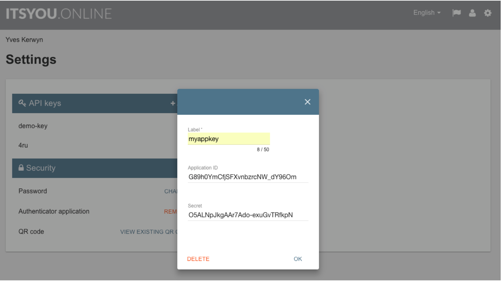

# Using the OpenvCloud Client

In order to use the OpenvCloud client you need a JSON Web token (JWT).

It is recommended to let the OpenvCloud client generate this JWT for you, by just passing your application ID and secret when instantiating the OpenvCloud client. So you first need an application ID and secret.

You get this application ID and secret by creating an API key on the settings page of your [ItsYou.online](https://itsyou.online) user profile.



For the below example we will save the application ID and secret in a YAML formated `config.yaml` configuration file structured as follows:
```yaml
iyo:
  appid: FjMckSiqtJK8XABCRNeakTowfxVp
  secret: gXpM4fPfHiXTb3blaJwmAV0Y72kB

openvcloud:
  url: 'https://se-gen-1.demo.greenitglobe.com'
```

From within you code you can then easily read the application ID and secret from the configuration file:
```python
config = j.data.serializer.yaml.load("config.yaml")
applicationId = config["iyo"]["appid"]
secret = config["iyo"]["secret"]
url = config["openvcloud"]["url"]
```

With this connecting is simple:
```python
client = j.clients.openvcloud.get(applicationId, secret, url)
```

Alternatively, you can also connect to an OpenvCloud environment with a legacy username and password. This is highly discouraged though. You should only choose this option in a strictly private deployment where ItsYou.online is unavailable:
```python
login = "<your legacy username>"
password = "<your legacy password>"
client = j.clients.getLegacy(url, login, password)
```

Next we discuss:
- [Cloud API](#cloud-api)
- [Accounts](#accounts)
- [Cloud Spaces](#cloud-spaces)
- [Virtual Machines](#virtual-machines)
- [Prefab](#prefab)

<a id="cloud-api"></a>
## Accessing the Cloud API

The OpenvCloud client uses the OpenvCloud Cloud API underneath. You can access the OpenvCloud Cloud API via the OpenvCloud client via the `api` attribute of the OpenvCloud client.

List all OS images using the OpenvCloud API:
```python
client.api.cloudapi.images.list()
```

For more details about using the OpenvCloud API see[How to use the OpenvCloud Cloud API](OVC_API.md).

<a id="accounts"></a>
## Accounts

Access an account:
```python
account_name = "<your OpenvCloud account name here>"
account = client.account_get(account_name)
```

The above code will try to create a new account in case there was no account found with the given name. This default behavior can switched off by passing `False` the optional `create` argument:
```python
account = client.account_get(account_name, create=False)
```

<a id="cloud-spaces"></a>
## Cloud Spaces

List all cloud spaces:
```python
account.spaces
```

Get the first cloud space:
```python
vdc = account.spaces[0]
```

Or get a cloud space by name:
```python
cloud_space_name = "<your cloud space name here>"
locations = client.locations
location = locations[0]['locationCode']
vdc = account.space_get(cloud_space_name, location)
```

The above code will create a new cloud space if the cloud space doesn't exist yet. In case you don't want this behavior, set the `create` argument to `False` (the default is `True`):
```python
vdc = account.space_get(cloud_space_name, location, create=False)
```

Also note that we specified the first available location to create to cloud space in.

List all available images that are available in a cloud space:
```python
print([item["name"] for item in vdc.images])
```

<a id="virtual-machines"></a>
## Virtual Machines

List the machines in the cloud space:
```python
vdc.machines
```

Get a machine:
```python
machine_name = "..."
vm = vdc.machines.get(machine_name)
```

Create a new virtual machines:
```python
sshkeyname = "<name of the SSH private key loaded by the SSH agent>"
machine = vdc.machine_create(name=name, sshkeyname = sshkeyname)
```

This will create new virtual machine using default values:
- Ubuntu 16.04 with 2GB memory
- 1 virtual CPU core
- 10 GB boot disk

Alternatively you can also get an existing machine, and have it created if it doesn't exist yet:
```python
machine = vdc.machine_get(name=name, create=True, sshkeyname=sshkeyname)
```

See all properties of the virtual machine:
```python
machine.model
```

List the disks:
```python
machine.disks
```

<a id="prefab"></a>
## Prefab

From a machine object you can easily access prefab executor for the machine: 
```python
p = machine.prefab
```

With this prefab executor you can for instance install the basic system services: 
```python
p.system.base.install()
```